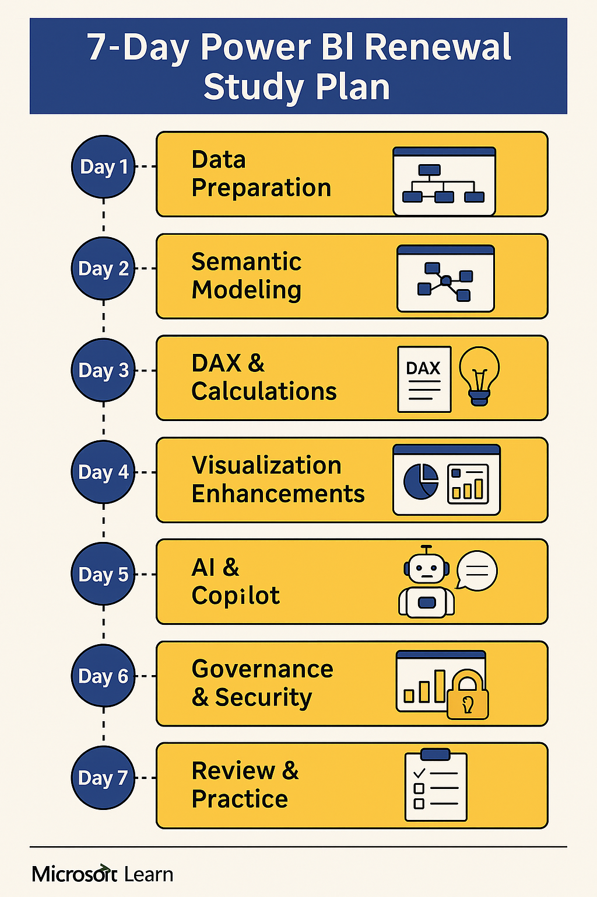
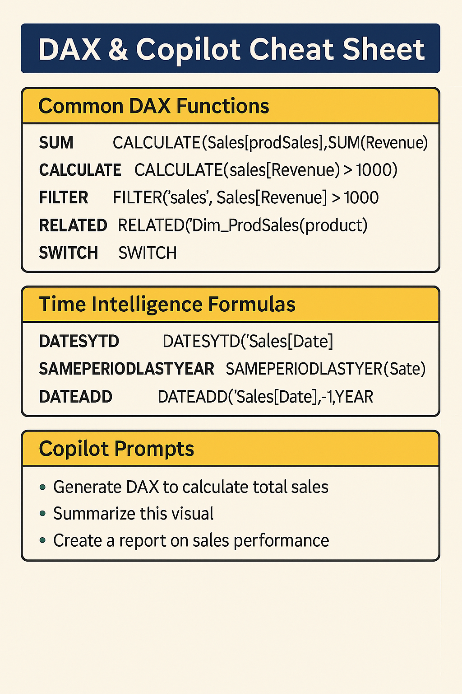

# Power BI Renewal Toolkit 
This repository provides everything you need to prepare for the **Microsoft Certified: Power BI Data Analyst Associate renewal**.

## Overview
This blog post provides a complete hands-on workflow to help you renew your Microsoft Certified: Power BI Data Analyst Associate certification. It covers the latest features like Copilot, Direct Lake, and advanced DAX, and includes study plans, cheat sheets, dashboard exercises, and exam simulations.

## Contents

- ✅ DAX & Copilot Cheat Sheet
- ✅ Quick Reference Guide
- ✅ Hands-On Dashboard Exercise
- ✅ Practice Dataset (Excel)
- ✅ Exam Simulation PDF (20 Questions)
- ✅ Mock Dashboard PDF
- ✅ Renewal Toolkit ZIP

## How to Use
1. Download the Master Pack ZIP.
2. Open the practice dataset in Power BI Desktop.
3. Follow the exercise guide to build your dashboard.
4. Review the cheat sheet and quick reference guide.
5. Test your knowledge with the exam simulation.

## Visuals
- **Study Plan Infographic**: Helps you organize your 7-day prep.
- **DAX Cheat Sheet**: Quick reference for common and advanced DAX formulas.

## License
MIT License
